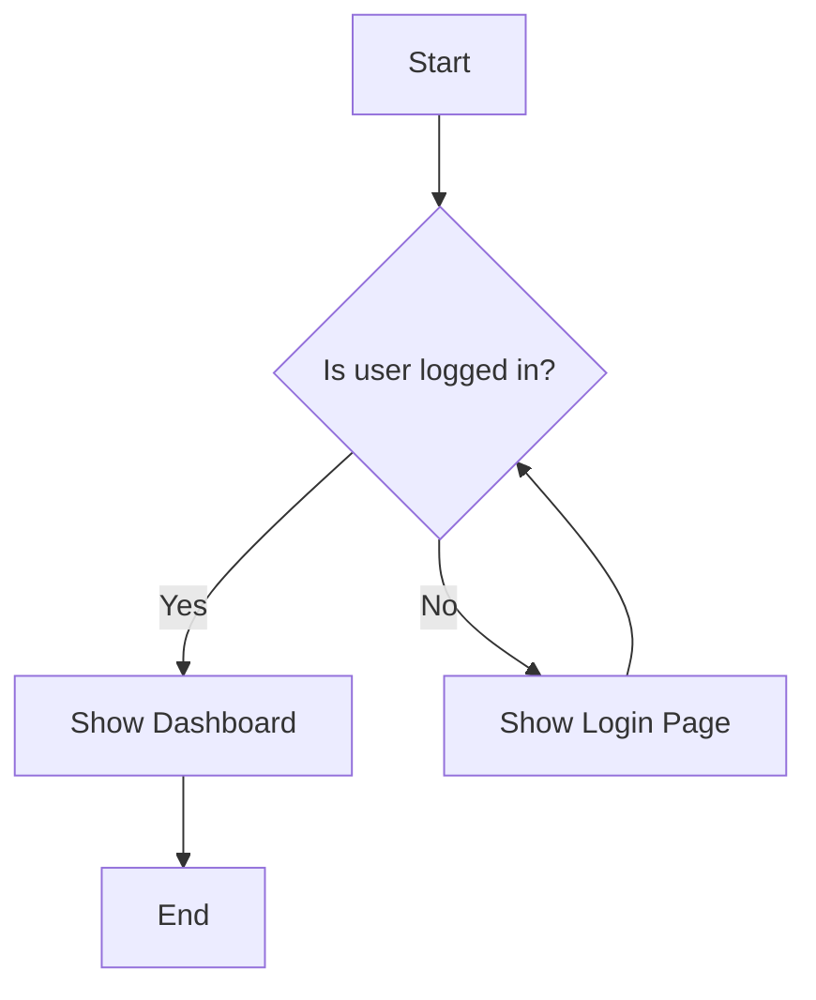
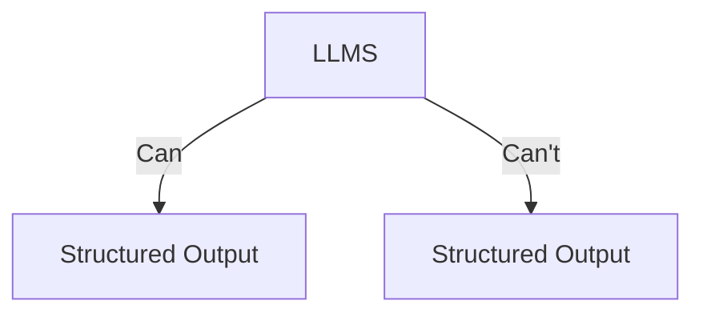
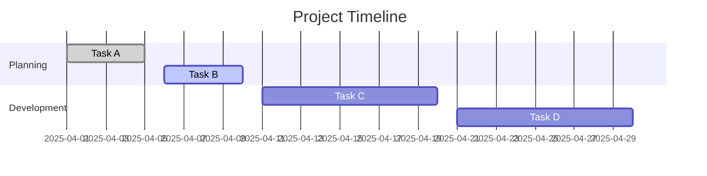
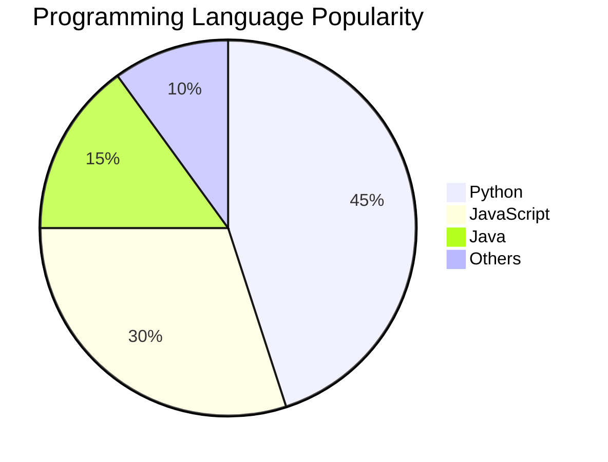
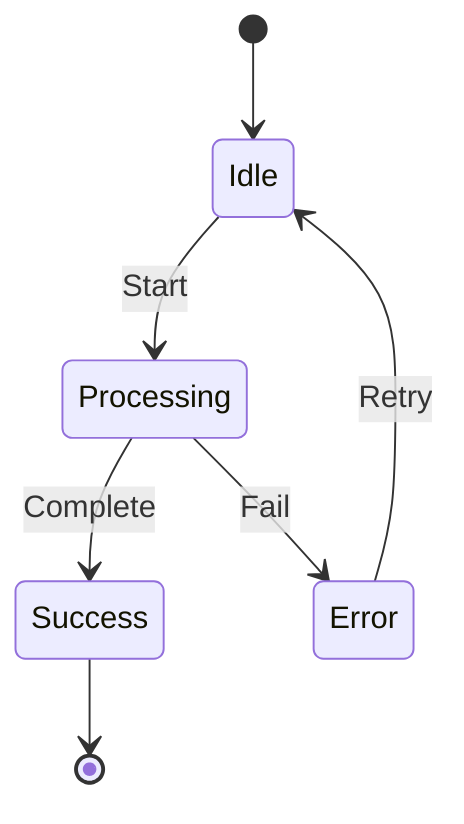
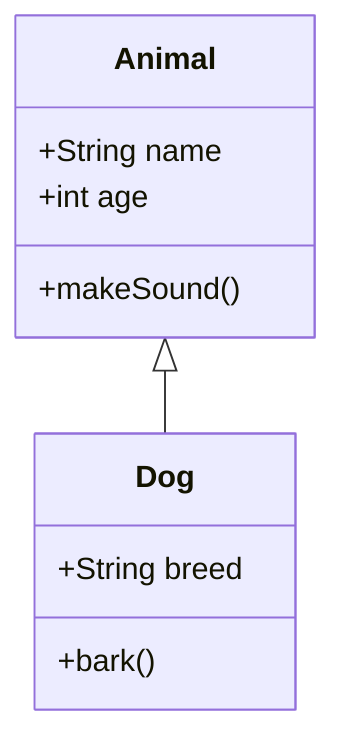
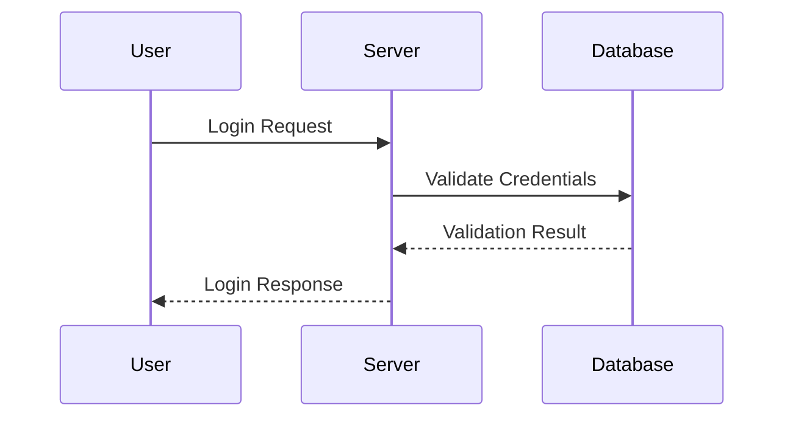

```mermaid
flowchart TD
    A[Start] --> B{Is user logged in?}
    B -->|Yes| C[Show Dashboard]
    B -->|No| D[Show Login Page]
    C --> E[End]
    D --> B
```



```mermaid
flowchart TD
    A[LLMS] --> |Can| B[Structured Output]
    A[LLMS] --> |Can't| C[Structured Output]
```


```mermaid
gantt
    title Project Timeline
    dateFormat  YYYY-MM-DD
    section Planning
    Task A :done, a1, 2025-04-01, 2025-04-05
    Task B :active, a2, 2025-04-06, 2025-04-10
    section Development
    Task C : a3, 2025-04-11, 2025-04-20
    Task D : a4, 2025-04-21, 2025-04-30
```



```mermaid
pie
    title Programming Language Popularity
    "Python" : 45
    "JavaScript" : 30
    "Java" : 15
    "Others" : 10
```



```mermaid
stateDiagram-v2
    [*] --> Idle
    Idle --> Processing : Start
    Processing --> Success : Complete
    Processing --> Error : Fail
    Success --> [*]
    Error --> Idle : Retry
```



```mermaid
classDiagram
    class Animal {
        +String name
        +int age
        +makeSound()
    }
    class Dog {
        +String breed
        +bark()
    }
    Animal <|-- Dog
```



```mermaid
sequenceDiagram
    participant User
    participant Server
    participant Database

    User->>Server: Login Request
    Server->>Database: Validate Credentials
    Database-->>Server: Validation Result
    Server-->>User: Login Response
```


```mermaid

```