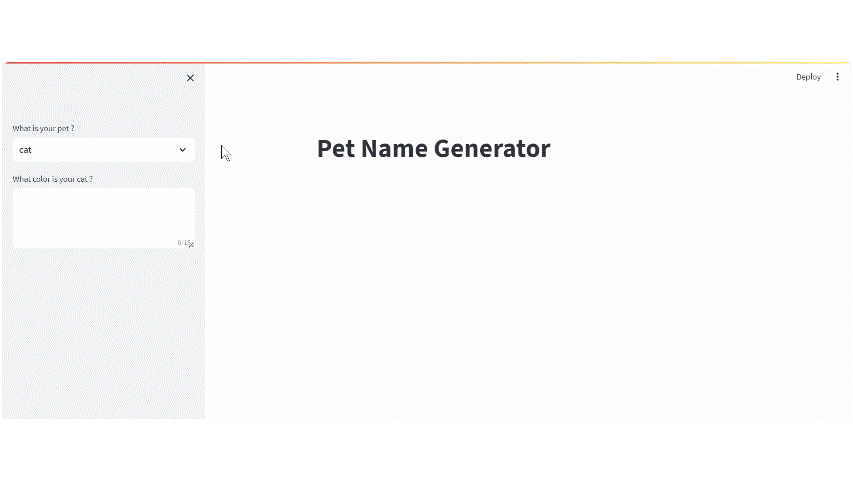

# Langchain
langchain - toos, agent, chain
## 1. Name Generator for pets
  

Uses - Langchain, OpenAI, streamlit

## 2. YouTube Assistant
Ask questions about video to the LLM powered Assistant. 

Uses - Langchain Document Loader, FAISS Vector db, Langchain Text Splitter, OpenAI API

